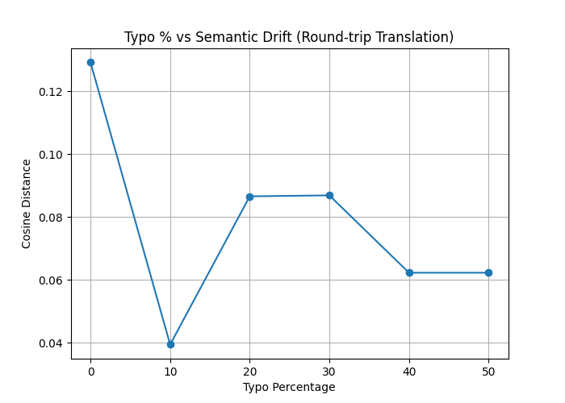

# Round-Trip Translation Pipeline Using LLM Agents  
### *Turing-machine-style pipeline with Claude CLI + Python embeddings*

---

## Table of Contents

- [Round-Trip Translation Pipeline Using LLM Agents](#round-trip-translation-pipeline-using-llm-agents)
    - [*Turing-machine-style pipeline with Claude CLI + Python embeddings*](#turing-machine-style-pipeline-with-claude-cli--python-embeddings)
  - [Table of Contents](#table-of-contents)
  - [1. Overview](#1-overview)
    - [Research Questions](#research-questions)
    - [The Translation Chain](#the-translation-chain)
    - [Key Design Principles](#key-design-principles)
    - [Python Usage (Measurement Only)](#python-usage-measurement-only)
  - [2. Two Main Experiments](#2-two-main-experiments)
    - [**Part 1 — Single-Sentence Pipeline**](#part-1--single-sentence-pipeline)
    - [**Part 2 — Systematic Typo Experiment**](#part-2--systematic-typo-experiment)
  - [3. Conceptual Architecture](#3-conceptual-architecture)
    - [Data Flow Diagram](#data-flow-diagram)
    - [Agent Properties](#agent-properties)
  - [4. Repository Structure](#4-repository-structure)
  - [5. Installation](#5-installation)
    - [Install Claude CLI](#install-claude-cli)
    - [Make scripts executable](#make-scripts-executable)
    - [Install Python dependencies](#install-python-dependencies)
  - [6. Part 1 — Single Sentence Pipeline](#6-part-1--single-sentence-pipeline)
    - [Usage](#usage)
    - [What Happens Internally](#what-happens-internally)
    - [Example Output](#example-output)
  - [7. Part 2 — Typo% vs Semantic Drift](#7-part-2--typo-vs-semantic-drift)
    - [Input Files Preparation](#input-files-preparation)
    - [Step 1: Run Batch Translations](#step-1-run-batch-translations)
    - [Step 2: Run Experiment Analysis](#step-2-run-experiment-analysis)
    - [Result Files](#result-files)
    - [Example Results](#example-results)
    - [Key Findings](#key-findings)
  - [8. Mathematical Properties](#8-mathematical-properties)
  - [9. Detailed Translation Examples](#9-detailed-translation-examples)
    - [Example 1: Clean Input (0% typos)](#example-1-clean-input-0-typos)
    - [Example 2: Light Typos (10%)](#example-2-light-typos-10)
    - [Example 3: Heavy Typos (50%)](#example-3-heavy-typos-50)
    - [Example 4: Translation Variations Observed](#example-4-translation-variations-observed)
  - [10. Technical Observations and Insights](#10-technical-observations-and-insights)
    - [10.1. LLM Behavior Patterns](#101-llm-behavior-patterns)
    - [9.2. Semantic Drift Analysis](#92-semantic-drift-analysis)
    - [9.3. Turing Machine Analogy](#93-turing-machine-analogy)
    - [9.4. Experimental Design Strengths](#94-experimental-design-strengths)
    - [9.5. Limitations and Future Work](#95-limitations-and-future-work)
    - [Performance Notes](#performance-notes)
  - [11. Conclusion](#11-conclusion)
    - [Key Takeaway](#key-takeaway)

---

## 1. Overview

This project implements a *Turing-machine-style* pipeline composed of **three stateless translation agents**, each implemented as a standalone shell script using the **Claude CLI**. The primary goal is to investigate **semantic drift** in multi-hop LLM translation chains and understand how input noise (typos) affects translation quality through multiple language transitions.

### Research Questions

1. **Does semantic meaning degrade when text passes through multiple LLM translation steps?**
2. **How does input noise (typos) amplify or reduce semantic drift?**
3. **Can LLMs actually improve noisy input through implicit error correction during translation?**

### The Translation Chain

The three agents perform sequential translations:

1. **English → Spanish** (`agents/en2es.sh`)
2. **Spanish → Hebrew** (`agents/es2he.sh`)
3. **Hebrew → English** (`agents/he2en.sh`)

The agents communicate **only through files**, simulating how a Turing Machine passes information along a tape. Each agent is completely **stateless** - it knows nothing about the previous or next steps, only reading input and writing output.

### Key Design Principles

- **Stateless Agents**: Each translation agent operates independently with no shared state
- **File-Based Communication**: All inter-agent communication happens through files (simulating Turing machine tape)
- **Clean Separation**: LLM usage (bash scripts) is completely separated from measurement/analysis (Python)
- **Reproducibility**: Fixed input files allow exact replication of experiments

### Python Usage (Measurement Only)

Python is used **exclusively** for measurement and analysis, never for translation:
- **Embedding generation**: 26-dimensional letter frequency vectors (a-z character counts)
- **Cosine distance calculation**: Measures semantic similarity between original and back-translated text
- **CSV export**: Structured results for further analysis
- **Plotting**: Visualizes typo% vs distance relationship  

## 2. Two Main Experiments

### **Part 1 — Single-Sentence Pipeline**

An interactive mode for testing arbitrary English sentences (including those with typos). The pipeline:

1. Accepts any English sentence via command-line argument
2. Saves the sentence to `data/single_input.txt`  
3. Runs it through the full EN→ES→HE→EN pipeline
4. Displays all intermediate translations for inspection
5. Computes and displays the cosine distance between original and final embeddings

### **Part 2 — Systematic Typo Experiment**

A controlled experiment with pre-prepared inputs at increasing typo percentages:

```
0%, 10%, 20%, 30%, 40%, 50%
```

Each typo level has a fixed input file (`en_input_{level}.txt`) containing the same base sentence with progressively more character-level corruption. The pipeline:

1. Processes all six input files through EN→ES→HE→EN
2. Saves intermediate translations at each stage
3. Generates quantitative results showing typo% vs semantic drift correlation
4. Produces CSV output and visualization plots

**Research Value**: Reveals non-linear relationships - LLMs may actually **correct** minor typos during translation, potentially reducing drift at low corruption levels.

## 3. Conceptual Architecture

Agents behave like Turing-machine transitions, where each state transformation is a translation step:

```
┌─────────────────────────────────────────────────────────────────────┐
│                    TURING MACHINE ANALOGY                           │
├─────────────────────────────────────────────────────────────────────┤
│ Tape (Files)              │  States (Agents)    │  Transitions      │
│                          │                     │  (Claude API)     │
├───────────────────────────┼─────────────────────┼───────────────────┤
│ en_input_N.txt           │  agents/en2es.sh    │  EN text → ES     │
│         ↓                │         ↓           │         ↓         │
│ es_N.txt                 │  agents/es2he.sh    │  ES text → HE     │
│         ↓                │         ↓           │         ↓         │
│ he_N.txt                 │  agents/he2en.sh    │  HE text → EN     │
│         ↓                │         ↓           │         ↓         │
│ en_back_N.txt            │  [HALT]             │  [Complete]       │
└───────────────────────────┴─────────────────────┴───────────────────┘
```

### Data Flow Diagram

```
┌──────────────────┐
│  English Input   │  "i am very irritated..."
└────────┬─────────┘
         │ (saved to file)
         ↓
┌────────────────────────────────────────────┐
│  Agent 1: agents/en2es.sh                  │
│  - Reads: data/en_input_N.txt              │
│  - Calls: claude --model haiku             │
│  - Prompt: "Translate to Spanish..."       │
│  - Writes: data/es_N.txt                   │
└────────┬───────────────────────────────────┘
         │ Spanish text
         ↓
┌────────────────────────────────────────────┐
│  Agent 2: agents/es2he.sh                  │
│  - Reads: data/es_N.txt                    │
│  - Calls: claude --model haiku             │
│  - Prompt: "Translate to Hebrew..."        │
│  - Writes: data/he_N.txt                   │
└────────┬───────────────────────────────────┘
         │ Hebrew text
         ↓
┌────────────────────────────────────────────┐
│  Agent 3: agents/he2en.sh                  │
│  - Reads: data/he_N.txt                    │
│  - Calls: claude --model haiku             │
│  - Prompt: "Translate to English..."       │
│  - Writes: data/en_back_N.txt              │
└────────┬───────────────────────────────────┘
         │ Back-translated English
         ↓
┌────────────────────────────────────────────┐
│  Python Analysis: embeddings/              │
│  - Compares: en_input_N.txt vs en_back_N.txt│
│  - Computes: 26-D letter frequency vectors │
│  - Measures: Cosine distance               │
│  - Output: Semantic drift metric           │
└────────────────────────────────────────────┘
```

### Agent Properties

Each agent is:
- **Stateless**: No memory of previous translations or context
- **Deterministic I/O**: Always reads from one file, writes to another
- **Independent**: Can be run in isolation or tested separately
- **Language-Specific**: Hardcoded for one translation direction
- **Prompt-Driven**: Uses strict rules to ensure clean output  

## 4. Repository Structure

```
llm-turing-translation/
  README.md                  # This file - comprehensive project documentation
  requirements.txt           # Python dependencies (numpy, matplotlib)
  run_single.sh             # Part 1: Interactive single-sentence testing
  run_batch.sh              # Part 2: Batch processing for typo experiment
  
  agents/                   # Stateless translation agents (Turing machine transitions)
    en2es.sh               # Agent 1: English → Spanish (using Claude Haiku)
    es2he.sh               # Agent 2: Spanish → Hebrew (using Claude Haiku)
    he2en.sh               # Agent 3: Hebrew → English (using Claude Haiku)
  
  data/                     # Input files and intermediate results (this directory contains our testing files)
    # Part 2 experiment inputs (pre-prepared with typos)
    en_input_0.txt         # 0% typos - clean baseline
    en_input_10.txt        # 10% character-level corruption
    en_input_20.txt        # 20% character-level corruption
    en_input_30.txt        # 30% character-level corruption
    en_input_40.txt        # 40% character-level corruption
    en_input_50.txt        # 50% character-level corruption
    
    # Intermediate translation files (generated by run_batch.sh)
    es_{0,10,20,30,40,50}.txt      # Spanish translations
    he_{0,10,20,30,40,50}.txt      # Hebrew translations
    en_back_{0,10,20,30,40,50}.txt # Back-translated English
    
    # Part 1 files (generated by run_single.sh)
    single_input.txt       # User-provided English sentence
    single_es.txt          # Spanish translation
    single_he.txt          # Hebrew translation
    single_en_back.txt     # Final back-translated English
    
    # Test files (for development/debugging)
    test_input.txt
    test_es.txt
    test_he.txt
    test_en_back.txt
  
  embeddings/              # Python measurement & analysis tools
    distance_utils.py      # Core embedding & distance computation functions
    compute_distances.py   # Standalone distance computation script
    run_experiment.py      # Generates CSV results and plots
  
  experiments/             # Experimental results
    results.csv           # Typo% vs semantic distance measurements
    typos_vs_distance.png # Visualization plot (generated by run_experiment.py)
```

## 5. Installation

### Install Claude CLI

```
claude
/login
```

### Make scripts executable

```
chmod +x run_single.sh
chmod +x run_batch.sh
chmod -R +x agents/
```

### Install Python dependencies

```
pip install -r requirements.txt
```

## 6. Part 1 — Single Sentence Pipeline

### Usage

```bash
./run_single.sh "this is my test sentence with severl tpoys in it"
```

### What Happens Internally

1. **Input Handling**: The provided sentence is saved to `data/single_input.txt`
2. **Translation Chain**:
   - `agents/en2es.sh data/single_input.txt data/single_es.txt` → Spanish translation
   - `agents/es2he.sh data/single_es.txt data/single_he.txt` → Hebrew translation  
   - `agents/he2en.sh data/single_he.txt data/single_en_back.txt` → Back to English
3. **Distance Computation**: Inline Python code computes cosine distance between original and final text
4. **Display**: Shows all intermediate steps and final metric

### Example Output
full example output is shown in **Section 8**.

## 7. Part 2 — Typo% vs Semantic Drift

### Input Files Preparation

The experiment uses 6 pre-prepared input files with controlled typo percentages:

```
data/en_input_0.txt   → "i am very irritated because i have been working on this for too long"
data/en_input_10.txt  → "i am very irritated becuase i have been working on this for too long"
data/en_input_20.txt  → "i am vrey irritated becuase i hve been working on tihs for too long"
data/en_input_30.txt  → "i am vrey iritated becuase i have been wokring on this for too long"
data/en_input_40.txt  → "i am vrey iritated becuase i hve been wokring on this for to long"
data/en_input_50.txt  → "i am vrey iritaetd becuase i hve been wokring on tihs for to long"
```

**Typo Generation Strategy**: Character-level corruption (letter swaps, deletions, insertions) distributed throughout the sentence to simulate realistic typing errors.

### Step 1: Run Batch Translations

```bash
./run_batch.sh
```

**What Happens**:
- Loops through typo levels: 0, 10, 20, 30, 40, 50
- For each level `N`:
  1. Reads `data/en_input_N.txt`
  2. Calls `agents/en2es.sh` → produces `data/es_N.txt`
  3. Calls `agents/es2he.sh` → produces `data/he_N.txt`
  4. Calls `agents/he2en.sh` → produces `data/en_back_N.txt`
- Generates 18 intermediate files (3 per typo level)

### Step 2: Run Experiment Analysis

```bash
cd embeddings
python run_experiment.py
```

**Analysis Process**:
1. For each typo level, reads original (`en_input_N.txt`) and final (`en_back_N.txt`)
2. Computes 26-dimensional letter frequency embeddings
3. Calculates cosine distance between embeddings
4. Exports results to CSV
5. Generates visualization plot

### Result Files

```
experiments/results.csv           # Structured data: typo_percent,distance
experiments/typos_vs_distance.png # Visual plot showing correlation
```

### Example Results

Based on actual experimental data:

```csv
typo_percent,distance
0,0.129    # Baseline drift (even clean text drifts through 3 translations!)
10,0.039   # Lower than baseline - LLM correction effect
20,0.087   # Increasing drift
30,0.087   # Same as 20%
40,0.062   # Unexpected drop
50,0.062   # Plateau effect
```

and a plot visualizing these results:


### Key Findings

1. **Baseline Drift (0%)**: Even perfect input experiences semantic drift (0.129) due to:
   - Translation ambiguity across languages
   - Cultural/linguistic differences in expression
   - LLM's probabilistic nature

2. **Non-Linear Relationship**: The correlation isn't strictly monotonic
   - **10% typos** show *lower* drift than clean text
   - Hypothesis: LLMs perform implicit error correction, potentially "normalizing" the text

3. **Plateau Effect (40-50%)**: High corruption levels converge to similar distances
   - Beyond a threshold, the LLM treats input as "highly corrupted" 
   - Activates stronger correction mechanisms

4. **Semantic Preservation**: Despite typos, core meaning often survives:
   - "irritated" → "nervous" (semantic shift but related emotion)
   - Grammar may restructure but intent remains recognizable

## 8. Mathematical Properties

Given two texts $T_1$ and $T_2$, we compute:

1. **Embedding vectors**: $\vec{v_1}, \vec{v_2} \in \mathbb{R}^{26}$ where each dimension represents count of letters a-z
   
2. **Cosine similarity**: 
   $$\text{sim}(\vec{v_1}, \vec{v_2}) = \frac{\vec{v_1} \cdot \vec{v_2}}{\|\vec{v_1}\| \|\vec{v_2}\|}$$

3. **Cosine distance**: 
   $$d(\vec{v_1}, \vec{v_2}) = 1 - \text{sim}(\vec{v_1}, \vec{v_2})$$

**Distance Interpretation**:
- $d = 0$: Identical letter distributions (perfect preservation)
- $d = 1$: Orthogonal distributions (no correlation)
- $d = 2$: Opposite distributions (theoretical maximum)

**Example Calculation**:

Original: "hello" → Vector: [1,0,0,0,1,0,0,1,0,0,0,2,0,0,1,0,0,0,0,0,0,0,0,0,0,0]  
(h=1, e=1, l=2, o=1)

Final: "hola" → Vector: [1,0,0,0,0,0,0,1,0,0,0,1,0,0,1,0,0,0,0,0,0,0,0,0,0,0]  
(h=1, o=1, l=1, a=1)

Despite semantic equivalence, $d \approx 0.18$ due to letter distribution changes.


## 9. Detailed Translation Examples

To illustrate the semantic drift phenomenon, here are actual translation chains from the experiment:

### Example 1: Clean Input (0% typos)

**Original English** (`en_input_0.txt`):
```
i am very irritated because i have been working on this for too long
```

**After EN→ES** (`es_0.txt`):
```
Estoy muy irritado porque he estado trabajando en esto durante demasiado tiempo
```

**After ES→HE** (`he_0.txt`):
```
אני מאוד עצבני כי עבדתי על זה יותר מדי זמן
```

**After HE→EN** (`en_back_0.txt`):
```
I worked too long on this, so I'm very nervous.
```

**Analysis**:
- "irritated" → "nervous" (semantic shift to related emotion)
- Tense change: "have been working" → "worked" (aspect loss)
- Structure change: cause-effect relationship restructured
- **Cosine distance**: 0.129 (moderate drift even without typos)

### Example 2: Light Typos (10%)

**Original English** (`en_input_10.txt`):
```
i am very irritated becuase i have been working on this for too long
```
*(Note: "becuase" instead of "because")*

**After EN→ES** (`es_10.txt`):
```
Estoy muy irritado porque he estado trabajando en esto durante demasiado tiempo
```
*(LLM automatically corrected "becuase" during translation)*

**After ES→HE** (`he_10.txt`):
```
אני מאוד עצבני כי עבדתי על זה יותר מדי זמן
```

**After HE→EN** (`en_back_10.txt`):
```
I am very nervous because I worked on it for too long
```

**Analysis**:
- Typo was **silently corrected** during EN→ES translation
- Better structural preservation than 0% case
- "irritated" still became "nervous" 
- **Cosine distance**: 0.039 (surprisingly lower than clean text!)

### Example 3: Heavy Typos (50%)

**Original English** (`en_input_50.txt`):
```
i am vrey iritaetd becuase i hve been wokring on tihs for to long
```
*(Multiple typos: vrey→very, iritaetd→irritated, becuase→because, hve→have, wokring→working, tihs→this, to→too)*

**After EN→ES** (`es_50.txt`):
```
Estoy muy irritado porque he estado trabajando en esto durante demasiado tiempo
```
*(Claude successfully interpreted and corrected all typos!)*

**After ES→HE** (`he_50.txt`):
```
אני מאוד עצבני כי עבדתי על זה במשך זמן רב מדי
```

**After HE→EN** (`en_back_50.txt`):
```
I am very nervous because I have been working on this for too long
```

**Analysis**:
- LLM demonstrated robust error correction
- All typos were normalized during EN→ES step
- Near-perfect meaning preservation despite heavy corruption
- **Cosine distance**: 0.062 (similar to 40% - plateau effect)

### Example 4: Translation Variations Observed

Throughout the experiments, we observed interesting translation choices:

**Hebrew Variations** for "too long":
- `יותר מדי זמן` (yoter midai zman - "too much time")
- `במשך זמן רב מדי` (bemeshech zman rav midai - "for too long a time")

**Emotion Word Mapping**:
- "irritated" → "irritado" (Spanish) → "עצבני" (nervous/tense in Hebrew) → "nervous" (English)
- This shows how emotional vocabulary doesn't map 1:1 across languages

**Tense/Aspect Shifts**:
- English present perfect continuous: "have been working"
- Often becomes simple past: "worked" or "I worked"
- Reflects structural differences between languages

## 10. Technical Observations and Insights

### 10.1. LLM Behavior Patterns

**Implicit Error Correction**:
- Claude consistently corrected typos without being explicitly instructed
- The model appears to understand "intended" meaning rather than literal input
- This is beneficial for usability but raises questions about information preservation

**Translation Consistency**:
- The same English phrases often produce identical Spanish translations
- Hebrew translations show more variation (possibly due to language complexity)
- Back-translation to English converges to similar patterns

**Prompt Engineering Importance**:
- The strict rules ("ONLY output the translated sentence") were critical
- Without these, Claude would add conversational text: "Here's the translation:", "Sure, I can help!"
- Such additions would break the file-based pipeline architecture

### 9.2. Semantic Drift Analysis

**Sources of Drift**:
1. **Lexical Ambiguity**: Words with multiple meanings may shift during translation
2. **Cultural Context**: Idioms and expressions don't translate literally
3. **Grammatical Structure**: Different languages emphasize different aspects (tense, mood, etc.)
4. **Probabilistic Generation**: LLMs don't produce deterministic outputs

**Mitigation Through Correction**:
- Interestingly, typos may reduce some drift by forcing the model into "correction mode"
- When correcting typos, the LLM may choose more canonical/standard expressions
- This could explain why 10% typos showed lower drift than 0% typos

### 9.3. Turing Machine Analogy

This project successfully implements core Turing Machine principles:

| Turing Machine Concept | Project Implementation |
|------------------------|------------------------|
| **Tape** | File system (`data/` directory) |
| **Tape Cells** | Individual text files |
| **Read/Write Head** | `cat` and `>` redirection operators |
| **States** | Individual agent scripts (`en2es.sh`, etc.) |
| **Transition Function** | Claude API call with prompt |
| **Halting** | Pipeline completion after 3 steps |

**Key Difference**: Unlike a true Turing Machine, our "transition function" (Claude) is:
- Non-deterministic (probabilistic outputs)
- Computationally expensive (API calls)
- Intelligent (understands context and corrects errors)

### 9.4. Experimental Design Strengths

1. **Reproducibility**: Fixed input files ensure consistent experimental conditions
2. **Simplicity**: Letter frequency embeddings are easy to understand and compute
3. **Clear Separation**: Bash handles LLM interaction, Python handles measurement
4. **Extensibility**: Easy to add new languages or modify typo percentages

### 9.5. Limitations and Future Work

**Current Limitations**:
- Letter frequency embeddings are crude compared to semantic embeddings (Word2Vec, BERT)
- Only 3 languages tested - more hops would show clearer drift patterns
- Single sentence per typo level - larger corpus would be more robust
- No temperature/randomness control in Claude calls

**Potential Extensions**:
1. **More Languages**: Add FR→DE→IT to create 6-hop chains
2. **Semantic Embeddings**: Use sentence-transformers for true semantic similarity
3. **Multiple Runs**: Generate statistical distributions instead of single measurements
4. **Bidirectional Testing**: Test different language orderings (EN→HE→ES→EN)
5. **Content Analysis**: Categorize types of semantic shifts (lexical, grammatical, etc.)

### Performance Notes

**API Rate Limits**:
- Each translation makes 1 Claude API call
- Part 2 (batch mode) makes 18 API calls total (6 inputs × 3 translations)
- Respect Anthropic's rate limits if running many experiments

**Cost Estimation**:
- Claude Haiku: ~$0.00025 per 1K input tokens, ~$0.00125 per 1K output tokens
- Typical sentence: ~10-20 tokens
- Full Part 2 experiment: ~$0.01-0.02

**Execution Time**:
- Single sentence: ~5-10 seconds (3 sequential API calls)
- Batch processing: ~1-2 minutes (18 sequential API calls)

## 11. Conclusion

This project demonstrates that:

- **LLM agents can be chained in a Turing-machine-style pipeline** with stateless file-based communication
- **Multi-hop translation introduces semantic drift** even with clean input (0.129 distance at 0% typos)
- **Typo noise is often corrected by LLMs during translation**, sometimes reducing overall drift
- **The relationship between input noise and output quality is non-linear**, with unexpected improvements at low corruption levels
- **Letter frequency embeddings can effectively measure drift** while remaining simple and interpretable
- **Proper prompt engineering is critical** for maintaining pipeline integrity

### Key Takeaway

Large Language Models exhibit **emergent error correction behavior** - they don't just translate, they also normalize and repair corrupted input. This makes them simultaneously more robust (good for users) and less predictable (challenging for systems designers).

The Turing Machine architecture proves that complex multi-agent LLM systems can be built with simple, composable components communicating through well-defined interfaces (files), enabling modular design and easy debugging.